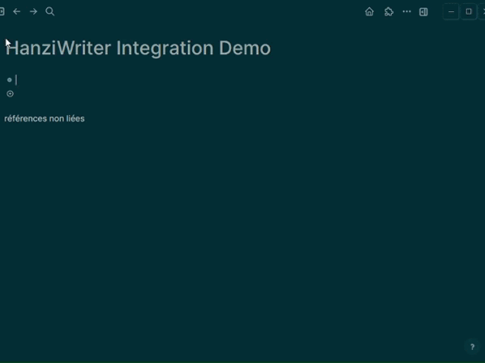

# ✍️ Logseq HanziWriter Integration

A Logseq plugin that integrates [HanziWriter](https://hanziwriter.org/) to provide interactive Chinese character writing practice directly in your notes. 🇨🇳

### 🎥 Demo

## 🙏 Credits

This plugin uses [HanziWriter](https://hanziwriter.org/), created by [Chanind](https://github.com/chanind). HanziWriter is a free, open-source JavaScript library for Chinese character stroke order animations and quizzes.

## ✨ Features

- 🖌️ Interactive Chinese character stroke order animations
- ✏️ Practice writing characters with stroke order quizzes
- 📚 Support for multiple characters side by side
- 🔄 Toggle between animation and quiz modes
- ✅ Visual feedback for correct stroke order
- 💡 Hints available after 3 missed attempts

## 🚀 Usage

1. Use the slash command `/Hanzi quiz 🈚` in any block
2. Type the character(s) you want to practice (e.g., `你好`)
3. A writing panel will appear with:
   - 🎯 Character animation showing stroke order
   - 🔄 "Switch Mode" button to toggle between animation and quiz modes
   - 📏 Grid background for proper character proportions

## 📥 Installation

1. Go to Logseq Settings -> Plugin Store
2. Search for "HanziWriter Integration"
3. Click Install

## 📄 License   

MIT License

## Author 

[PB]https://github.com/pb-pub

## 🌟 Acknowledgements

- 🖊️ [HanziWriter](https://hanziwriter.org/) by Chanind
- 🔌 [Logseq Plugin SDK](https://logseq.github.io/plugins/)
